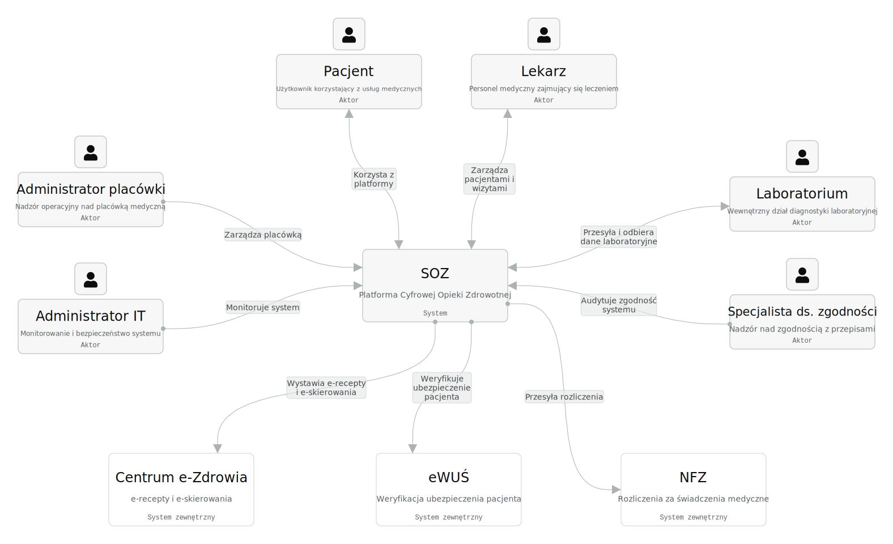
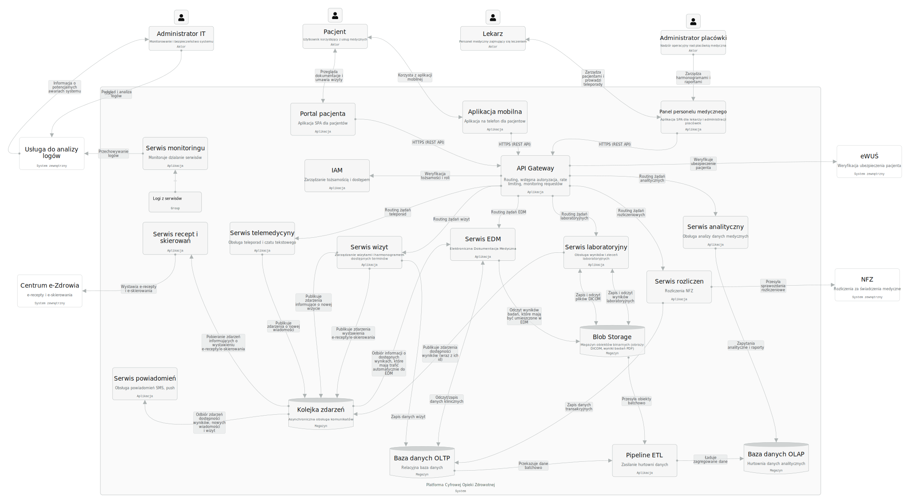
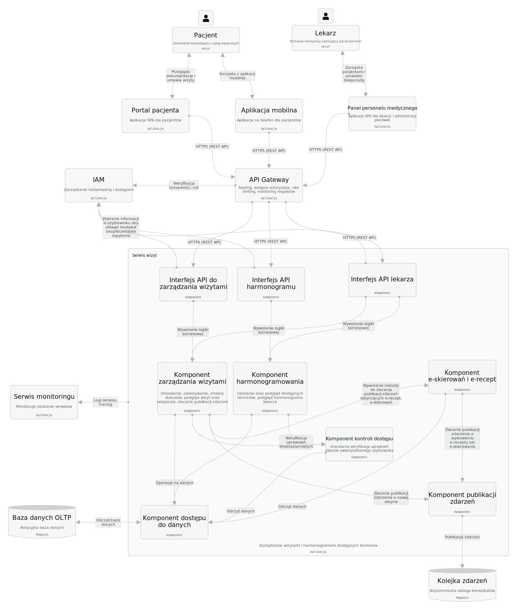

# Realizacja projektu - System Opieki Zdrowotnej (SOZ)


| | |
|-|-|
| Jakub Kieruczenko | 318669 |
| Aleksander Stanoch | XXXXXX |
| Sebastian Abramowski | YYYYYY |
| Kazimierz Lipski | ZZZZZZ |
---

## 1. Analiza wymagań

### 1.1 Aktorzy systemu i ich problemy

| Aktor | Rola w systemie | Główne problemy / oczekiwania |
|---|---|---|
| **Pacjent** | Użytkownik systemu korzystający z usług medycznych | Brak wglądu we własną dokumentację medyczną; konieczność osobistego umawiania wizyt; brak możliwości konsultacji lekarskich bez wychodzenia z domu |
| **Lekarz** | Użytkownik systemu zajmujący się leczeniem pacjentów | Brak dostępu do historii leczenia pacjenta z innych placówek; konieczność ręcznego prowadzenia dokumentacji medycznej; brak bezpośredniego dostępu do wyników badań pacjentów, w tym badań obrazowych; brak możliwości udzielania teleporad |
| **Laboratorium** | Dostarczyciel wyników badań | Brak zautomatyzowanego przekazywania wyników badań (papierowe lub mailowe); brak integracji z EDM pacjenta; brak możliwości przeglądania statystyk dotyczących wykonanych badań |
| **Administrator placówki** | Użytkownik systemu posiadający wgląd operacyjny w funkcjonowanie placówki (wizyty, pacjenci, harmonogram) | Brak centralnego wglądu w harmonogram wizyt; trudności w zarządzaniu rejestracją pacjentów; brak możliwości generowania raportów dotyczących funkcjonowania placówki |
| **Administrator IT** | Użytkownik odpowiedzialny za monitorowanie działania systemu w środowisku produkcyjnym oraz utrzymanie jego bezpieczeństwa | Brak możliwości monitorowania działania systemu w czasie rzeczywistym; brak narzędzi do szybkiego wykrywania i diagnozowania błędów; brak automatycznych powiadomień o awariach |
| **Specjalista ds. zgodności** | Osoba odpowiedzialna za nadzór nad zgodnością systemu z przepisami i politykami bezpieczeństwa | Brak możliwości weryfikacji zgodności działania systemu z obowiązującymi przepisami prawa; brak narzędzi do wykazania spełnienia wymogów regulacyjnych |

### 1.2 Zewnętrzne systemy publiczne

| System zewnętrzny | Cel integracji |
|---|---|
| **Centrum e-Zdrowia** | Obsługa e-recept oraz e-skierowań |
| **eWUŚ** | Możliwość weryfikacji ubezpieczenia pacjenta |
| **NFZ** | Rozliczanie świadczeń medycznych |

---

### 1.3 Wymagania funkcjonalne

#### F0 – Sposób dostępu do systemu

| ID | Wymaganie |
|---|---|
| F0.1 | System powinien umożliwiać pacjentowi korzystanie z funkcjonalności systemu za pośrednictwem portalu internetowego lub aplikacji mobilnej |
| F0.2 | System powinien umożliwiać pozostałym użytkownikom korzystanie z systemu za pośrednictwem portalu internetowego |

#### F1 – Zarządzanie wizytami

| ID | Wymaganie |
|---|---|
| F1.1 | System powinien umożliwiać pacjentowi umawianie i odwoływanie wizyt |
| F1.2 | System powinien umożliwiać pacjentowi podgląd dostępnych terminów wizyt dla wybranych lekarzy i przychodni |
| F1.3 | System powinien wysyłać pacjentowi automatyczne przypomnienia o nadchodzącej wizycie za pomocą wiadomości SMS |
| F1.4 | System powinien umożliwiać użytkownikom posiadającym odpowiednie uprawnienia podgląd szczegółów wizyty (data, godzina, gabinet, dane pacjenta) |
| F1.5 | System powinien umożliwiać lekarzowi podgląd dziennego harmonogramu wizyt |
| F1.6 | System powinien umożliwiać lekarzowi zmianę statusu wizyty |
| F1.7 | System powinien umożliwiać lekarzowi definiowanie dostępnych terminów wizyt |

#### F2 – Telemedycyna

| ID | Wymaganie |
|---|---|
| F2.1 | System powinien umożliwiać pacjentowi kontakt z lekarzem poprzez czat tekstowy |
| F2.2 | System powinien umożliwiać przesyłanie załączników w ramach komunikacji czatowej między pacjentem a lekarzem |
| F2.3 | System powinien umożliwiać pacjentowi umawianie wizyt w formie teleporad |
| F2.4 | System powinien umożliwiać lekarzowi dostęp do EDM pacjenta |
| F2.5 | System powinien umożliwiać lekarzowi wystawianie e-recept oraz e-skierowań w ramach konsultacji |

#### F3 – Elektroniczna Dokumentacja Medyczna (EDM)

| ID | Wymaganie |
|---|---|
| F3.1 | System powinien umożliwiać przechowywanie ujednoliconej dokumentacji medycznej pacjenta w ramach EDM |
| F3.2 | System powinien umożliwiać lekarzowi tworzenie, edytowanie i przeglądanie EDM pacjenta |
| F3.3 | System powinien umożliwiać pacjentowi przeglądanie i pobieranie fragmentów EDM przypisanej do niego |
| F3.4 | System powinien rejestrować historię zmian oraz dostępów do EDM, wraz z informacją o użytkowniku i czasie wykonania operacji oraz jej typie |
| F3.5 | System powinien umożliwiać przechowywanie i przeglądanie załączników z wynikami badań w ramach EDM w formatach PDF oraz DICOM |
| F3.6 | System powinien umożliwiać pacjentowi aktualizację jego danych osobowych |

#### F4 – Integracja laboratoryjna

| ID | Wymaganie |
|---|---|
| F4.1 | System powinien umożliwiać laboratorium przesyłanie wyników badań bezpośrednio do EDM pacjenta w formatach PDF oraz DICOM |
| F4.2 | System powinien powiadamiać pacjenta o dostępności wyników badań za pomocą wiadomości SMS |
| F4.3 | System powinien umożliwiać lekarzowi wystawianie zleceń badań laboratoryjnych dla pacjenta |
| F4.4 | System powinien umożliwiać wyszukiwanie zleceń badań laboratoryjnych na podstawie ich identyfikatora |
| F4.5 | System powinien umożliwiać pacjentowi podgląd i pobieranie wyników badań laboratoryjnych (format PDF, DICOM) na podstawie numeru PESEL oraz identyfikatora badania |

#### F5 – Analityka i raportowanie

| ID | Wymaganie |
|---|---|
| F5.1 | System powinien umożliwiać generowanie statystyk dotyczących liczby i rodzaju wykonanych badań laboratoryjnych |
| F5.2 | System powinien umożliwiać administratorowi przychodni generowanie statystyk dotyczących liczby wizyt |
| F5.3 | System powinien umożliwiać administratorowi przychodni wizualizację zajętości gabinetów |
| F5.4 | System powinien umożliwiać administratorowi przychodni podgląd zaplanowanych wizyt w konkretnych placówkach |
| F5.5 | System powinien umożliwiać generowanie raportów świadczeń medycznych zgodnie ze standardami wymaganymi przez NFZ |

#### F6 – Bezpieczeństwo

| ID | Wymaganie |
|---|---|
| F6.1 | System powinien dostosowywać dostęp do funkcji i widoków w zależności od przypisanej użytkownikowi roli |
| F6.2 | System powinien wymagać uwierzytelniania dwuskładnikowego (MFA) dla użytkowników innych niż pacjent |
| F6.3 | System powinien automatycznie wylogowywać użytkownika po określonym czasie bezczynności |

---

### 1.4 Wymagania niefunkcjonalne

#### NF1 - Zgodność i ochrona danych

| ID | Wymaganie |
|---|---|
| NF1.1 | System powinien zapewniać dostęp do EDM pacjenta wyłącznie uprawnionym użytkownikom |
| NF1.2 | System powinien zapewniać bezpieczeństwo danych poprzez szyfrowanie komunikacji oraz ochronę danych przechowywanych w bazie danych |
| NF1.3 | System powinien przetwarzać wyłącznie dane pacjenta niezbędne do realizacji usług medycznych |
| NF1.4 | System powinien zapewniać przetwarzanie danych medycznych wyłącznie w celach związanych z udzielaniem świadczeń zdrowotnych |
| NF1.5 | System powinien umożliwiać przechowywanie EDM przez wymagany okres czasu |
| NF1.6 | System powinien zapewniać przechowywanie EDM w sposób gwarantujący jej integralność, kompletność oraz możliwość odtworzenia |

#### NF2 – Monitorowanie systemu

| ID | Wymaganie |
|---|---|
| NF2.1 | System powinien zapewniać możliwość monitorowania swojego działania w czasie rzeczywistym |
| NF2.2 | System powinien umożliwiać monitorowanie obciążenia systemu |
| NF2.3 | System powinien umożliwiać szybkie wykrywanie i diagnozowanie błędów |
| NF2.4 | System powinien automatycznie powiadamiać administratora IT o awariach systemu |

#### NF3 - Utrzymywalność

| ID | Wymaganie |
|---|---|
| NF3.1 | System powinien umożliwiać wdrażanie aktualizacji wybranych komponentów bez przerywania działania systemu |
| NF3.2 | System powinien być wdrażany i utrzymywany w odrębnych środowiskach: deweloperskim, preprodukcyjnym oraz produkcyjnym |

#### NF4 - Dostępność i niezawodność

| ID | Wymaganie | Wartość docelowa |
|---|---|---|
| NF4.1 | Dostępność systemu (SLA) | ≥ 99.5% (dopuszczalne są planowane przerwy techniczne w godzinach nocnych) |
| NF4.2 | RTO (Recovery Time Objective) – czas odtworzenia po awarii | ≤ 4 godziny |
| NF4.3 | RPO (Recovery Point Objective) – maksymalna utrata danych | ≤ 1 godzina |

#### NF5 – Wydajność i skalowalność

| ID | Wymaganie | Wartość docelowa |
|---|---|---|
| NF5.1 | System powinien zapewniać krótki czas odpowiedzi dla podstawowych operacji | ≤ 1 s |
| NF5.2 | System powinien zapewniać szybkie ładowanie interfejsu użytkownika | ≤ 3 s |
| NF5.3 | System powinien obsługiwać zwiększoną liczbę użytkowników bez zauważalnego spadku wydajności | - |

#### NF6 – Interoperacyjność

| ID | Wymaganie |
|---|---|
| NF6.1 | System powinien umożliwiać przesyłanie danych EDM w formacie zgodnym ze standardem HL7 FHIR R4 |
| NF6.2 | System powinien umożliwiać przechowywanie i przeglądanie danych obrazowych w formacie DICOM |

---

### 1.5 Szacowanie skali systemu (Back of Envelope)

Poniższe oszacowanie ma wyznaczyć rząd wielkości systemu, a nie precyzyjną prognozę biznesową. Punktem wyjścia są dane z treści zadania: sieć obejmuje **5 szpitali i 20 przychodni**. Pozostałe liczby są jawnymi założeniami operacyjnymi przyjętymi dla typowego dnia roboczego, tak aby oszacowanie było spójne z aktualnymi wymaganiami: portal pacjenta, EDM, teleporady oparte o czat i załączniki, integracja laboratoryjna oraz obrazy DICOM.

#### Założenia bazowe

| Parametr | Wartość | Uzasadnienie |
|---|---|---|
| Placówki | 25 (5 szpitali + 20 przychodni) | Dane z treści zadania |
| Wizyty w przychodni | 120 / dzień / placówkę | Rząd wielkości dla kilku aktywnych gabinetów w trybie dziennym |
| Wizyty ambulatoryjne w szpitalu | 180 / dzień / placówkę | Poradnie przyszpitalne, konsultacje i kontrola pacjentów |
| Dni robocze dla ruchu ambulatoryjnego | 250 / rok | Uproszczone założenie do obliczeń rocznych |
| Udział teleporad | 8% wszystkich wizyt | Teleporada istnieje w wymaganiach, ale bez wideopołączeń |
| Wizyty kończące się zleceniem badań lab. | 35% | Nie każda konsultacja generuje badania |
| Wizyty kończące się badaniem obrazowym | 8% | DICOM dotyczy tylko części procesu diagnostycznego |
| Aktywne konta pacjentów | ~300 000 | Rząd wielkości dla grupy placówek tej skali |
| Aktywne konta personelu i administracji | ~4 000 | Lekarze, rejestracja, laboratoria, administratorzy |

#### Skala obsługiwanych wizyt

```
Przychodnie:                    20 x 120  = 2 400 wizyt / dzień
Szpitale (ambulatoryjnie):       5 x 180  =   900 wizyt / dzień
Łącznie:                                    3 300 wizyt / dzień

Wizyty rocznie:                 3 300 x 250 = ~825 000
Teleporady dziennie:            8% z 3 300   = ~260
```

#### Ruch użytkowników i obciążenie aplikacji

```
Dziennie aktywnych pacjentów:   ~4 000
Dziennie aktywnego personelu:   ~2 500
Łącznie DAU:                    ~6 500

Szczyt jednoczesnych sesji:     ~1 000
Nominalny ruch API:             ~80 req/s   (1 000 sesji, średnio 1 akcja / 12 s)
Ruch szczytowy z zapasem:       200-250 req/s
```

Taki poziom obciążenia jest spójny z wymaganiami niefunkcjonalnymi: czas odpowiedzi podstawowych operacji do 1 s i czas ładowania interfejsu do 3 s. System nie powinien być projektowany "na styk", tylko z zapasem na poranne i popołudniowe piki rejestracji, publikację wyników oraz wysyłkę powiadomień.

#### Dane transakcyjne i EDM

```
Rekord wizyty:                  ~6 KB
Przyrost danych wizyt / rok:    825 000 x 6 KB  = ~5 GB

Wpisy EDM i notatki:            średnio 3 wpisy po 25 KB / wizytę
Przyrost EDM / rok:             825 000 x 75 KB = ~60 GB

Dane pacjentów i słowniki:      rząd wielkości pojedynczych GB
```

Same rekordy relacyjne nie są duże; przestrzeń dyskową w systemie ochrony zdrowia zużywają głównie załączniki medyczne, pliki PDF i obrazy DICOM, a nie tabele transakcyjne.

#### Wyniki laboratoryjne

```
Zlecenia lab. dziennie:         35% z 3 300     = ~1 155
Wyniki na jedno zlecenie:       średnio 3
Pakiety wyników dziennie:       ~3 465
Średni rozmiar pakietu:         ~0.5 MB (PDF + metadane)

Przyrost danych / dzień:        ~1.7 GB
Przyrost danych / rok:          ~0.4 TB
```

#### Dane – obrazowanie medyczne (DICOM)

```
Badania obrazowe dziennie:      8% z 3 300      = ~260
Średni rozmiar badania:         ~60 MB
Przyrost danych / dzień:        ~15.6 GB
Przyrost danych / rok:          ~3.9 TB
```

#### Telemedycyna

```
Teleporady dziennie:            ~260
Wiadomości na teleporadę:       średnio 20
Wiadomości czatowe / dzień:     ~5 200
Załączniki / teleporadę:        średnio 2 po 1 MB
Przyrost załączników / rok:     ~0.13 TB
```

#### Całkowite zapotrzebowanie na przestrzeń dyskową (horyzont 3 lat)

| Kategoria danych | Rozmiar (3 lata) |
|---|---|
| Obrazowanie medyczne (DICOM) | ~11.7 TB |
| Wyniki laboratoryjne | ~1.2 TB |
| Załączniki z teleporad i komunikacji | ~0.4 TB |
| Rekordy wizyt i EDM | ~0.2 TB |
| Logi, kopie zapasowe, metadane | ~4.5 TB |
| **Łącznie** | **~18 TB** |

#### Podsumowanie – kluczowe parametry projektowe

| Parametr | Wartość |
|---|---|
| Użytkownicy (łącznie) | ~304 000 |
| Szczyt jednoczesnych sesji | ~1 000 |
| Szczyt API req/s | ~200-250 |
| Dane do przechowania (3 lata) | ~18 TB |
| Roczny przyrost danych | ~6 TB/rok |
| Model teleporady | czat + załączniki |
| Wymagana dostępność | 99.5% |

> Powyższe obliczenia wskazują, że system należy projektować przede wszystkim pod retencję danych medycznych, audyt i przechowywanie obrazów DICOM. Największym obciążeniem pojemnościowym są pliki diagnostyczne, a nie ruch telemedyczny, ponieważ obecne wymagania obejmują czat i załączniki zamiast połączeń wideo.

## 2. Analiza wymagań

### 2.1 Diagram kontekstu



### 2.2 Diagram kontenerów



### 2.3 Diagram komponentów - usługa umawiania wizyt



### 2.4 Diagram wdrożenia

### Decyzje architektoniczne

1. **Dwa regiony chmurowe (Polska Środkowa i Europa Zachodnia)**
Dane medyczne objęte są przepisami RODO (Rozporządzenie o Ochronie Danych Osobowych) oraz wymogami Narodowego Funduszu Zdrowia dotyczącymi lokalizacji przechowywania danych — region podstawowy musi znajdować się w Polsce. Drugi region pełni rolę środowiska odtwarzania po awarii i zapewnia parametry ciągłości działania: cel punktu odtwarzania (RPO — maksymalna dopuszczalna utrata danych w razie awarii) oraz cel czasu odtwarzania (RTO — maksymalny czas, po którym system musi być ponownie dostępny) zgodne z wymaganiami systemu krytycznego. Baza danych i magazyn plików są na bieżąco replikowane geograficznie do regionu zapasowego.

W regionie zapasowym działa klaster kontenerów w trybie uśpienia (standby) — jest uruchomiony, ale utrzymuje minimalną liczbę instancji usług (np. jedną zamiast trzech na strefę). Gdyby klaster był całkowicie wyłączony, jego uruchomienie po awarii zajęłoby kilkanaście minut (tworzenie węzłów obliczeniowych, pobieranie obrazów kontenerów z rejestru). Tryb uśpienia skraca czas przełączenia do sekund: globalna brama sieciowa (Azure Front Door) stale sprawdza dostępność regionu podstawowego i w razie wykrycia awarii automatycznie kieruje cały ruch do regionu zapasowego, który natychmiast doskalowuje się do pełnej liczby instancji. Koszt tego rozwiązania to stały wydatek na utrzymanie uśpionych węzłów obliczeniowych — jest to świadoma decyzja kupowania krótszego czasu odtwarzania kosztem wyższych wydatków operacyjnych.

2. **Zarządzany klaster kontenerów z trzema strefami dostępności**
Kontener to odizolowana jednostka uruchomieniowa zawierająca kod usługi wraz z jej zależnościami — lżejsza od maszyny wirtualnej i przenośna między środowiskami. Zarządzanie dużą liczbą kontenerów (uruchamianie, restartowanie po awarii, równoważenie obciążenia) wymaga platformy orkiestracji; pełni ją Kubernetes — oprogramowanie open-source pierwotnie opracowane przez Google. Usługa zarządzanych kontenerów Azure (*Azure Kubernetes Service*) dostarcza gotowy, zarządzany przez dostawcę klaster Kubernetes. Rozmieszcza mikroserwisy równomiernie w trzech niezależnych strefach dostępności w obrębie jednego regionu (fizycznie oddzielnych centrach danych), eliminując pojedynczy punkt awarii. Kubernetes automatycznie skaluje liczbę uruchomionych instancji w zależności od bieżącego obciążenia (np. wzrost liczby wizyt w sezonie grypowym).

3. **Strefa zdemilitaryzowana jako bufor między Internetem a usługami wewnętrznymi**
Strefa zdemilitaryzowana (DMZ) to wyodrębniony segment sieci, który stoi między publicznym Internetem a wewnętrzną siecią chronioną. Do strefy DMZ trafia cały ruch przychodzący z zewnątrz — ale nie może on stamtąd bezpośrednio dotrzeć do bazy danych ani kontenerów z logiką biznesową. Reguły zapory sieciowej pozwalają na przepływ w jednym kierunku: z Internetu do DMZ, i z DMZ do sieci wewnętrznej — nigdy bezpośrednio z Internetu do środka. W praktyce oznacza to, że nawet jeśli atakującemu uda się skompromitować komponent w strefie DMZ (np. równoważnik obciążenia), nadal napotka kolejną barierę przed dostępem do danych medycznych.

W architekturze systemu w strefie DMZ umieszczono dwa komponenty. Pierwszym jest **Azure Application Gateway** — zarządzany równoważnik obciążenia warstwy siódmej (najwyższej warstwy modelu sieciowego OSI, odpowiedzialnej za protokół HTTP). Rozumie treść żądań HTTP, dzięki czemu może trasować ruch na podstawie ścieżki adresu (np. `/wizyty/*` do serwisu wizyt, `/lab/*` do serwisu laboratoryjnego) i rozdzielać go równomiernie między węzły klastra. Drugim jest **Azure API Management** (skr. APIM) — zarządzana brama interfejsów programistycznych odpowiedzialna za uwierzytelnianie, ograniczanie liczby żądań i trasowanie ruchu do właściwych usług; opisana szczegółowo w punkcie 5.

4. **Globalna brama sieciowa z siecią dostarczania treści i zaporą aplikacyjną**
Azure Front Door to usługa brzegowa Microsoftu działająca w ponad 100 lokalizacjach na całym świecie. Pełni trzy role jednocześnie. Po pierwsze, jest globalnym punktem wejścia dla ruchu użytkowników — kieruje każde żądanie do najbliższego, zdrowego centrum danych zaplecza, skracając czas odpowiedzi. Po drugie, pełni rolę sieci dostarczania treści (skr. CDN — *Content Delivery Network*): statyczne zasoby interfejsu użytkownika (skrypty, style, obrazy) są kopiowane na serwery brzegowe rozmieszczone blisko użytkowników końcowych, dzięki czemu przeglądarka pobiera je z odległości setek, a nie tysięcy kilometrów. Po trzecie, wbudowana zapora aplikacji webowych (skr. WAF — *Web Application Firewall*) analizuje każde żądanie HTTP i blokuje znane wzorce ataków — wstrzykiwanie kodu SQL, ataki skryptowe czy próby nieuprawnionego dostępu — zanim żądanie dotrze do klastra. Jest to wymagane dla systemów przetwarzających dane medyczne zgodnie z normą bezpieczeństwa informacji ISO/IEC 27001.

4. **Zarządzanie interfejsem programistycznym i tożsamością**
Interfejs programistyczny (skr. API — *Application Programming Interface*) to zdefiniowany zestaw reguł określający, jak aplikacje mogą się ze sobą komunikować. Brama interfejsów programistycznych Azure API Management stanowi jeden punkt wejścia dla wszystkich wywołań kierowanych do mikroserwisów. Centralizuje: uwierzytelnianie z użyciem protokołu OAuth 2.0 (otwarty standard autoryzacji oparty na tokenach) i nakładki tożsamości OpenID Connect, ograniczanie liczby żądań na użytkownika lub klienta, trasowanie wywołań do właściwych usług zaplecza oraz rejestr wszystkich wywołań na potrzeby audytu. Zarządzanie tożsamością i dostępem (skr. IAM — *Identity and Access Management*) to ogólna warstwa kontroli uprawnień: decyduje, który użytkownik lub usługa może wykonać daną operację.

5. **Zarządzana kolejka komunikatów**
Mikroserwisy mogą komunikować się synchronicznie (jeden czeka na odpowiedź drugiego) lub asynchronicznie (jeden wysyła wiadomość i nie czeka). Komunikacja asynchroniczna jest odporniejsza na chwilowe niedostępności odbiorcy. Azure Service Bus to zarządzana usługa kolejkowania komunikatów: producent (np. serwis wizyt) umieszcza zdarzenie w kolejce, konsument (np. serwis powiadomień) odbiera je wtedy, gdy jest gotowy. Usługa gwarantuje dostarczenie każdej wiadomości przynajmniej raz, przechowuje je trwale na dysku oraz kieruje niedoręczone komunikaty do osobnej kolejki awaryjnej w celu późniejszej analizy.

6. **Pamięć podręczna dla danych często odczytywanych**
Pamięć podręczna (skr. cache) to szybki magazyn tymczasowy przechowujący wyniki kosztownych zapytań do bazy danych, by nie powtarzać ich przy każdym żądaniu. Azure Cache for Redis jest zarządzaną instancją bazy Redis — magazynu danych działającego w pamięci operacyjnej, wielokrotnie szybszego od dyskowej bazy relacyjnej. Przechowuje dane sesji zalogowanych użytkowników oraz wyniki często odpytywanych danych (np. harmonogram dostępności lekarzy), redukując obciążenie bazy transakcyjnej podczas szczytu.

7. **Warstwa analityczna odizolowana od systemu transakcyjnego**
Baza transakcyjna (skr. OLTP — *Online Transaction Processing*, czyli przetwarzanie transakcji on-line) jest zoptymalizowana pod kątem szybkich zapisów i odczytów pojedynczych rekordów. Uruchamianie na niej złożonych zapytań analitycznych (np. trendy zachorowań, obłożenie placówek) spowolniłoby pracę lekarzy i pacjentów. Dlatego dane są kopiowane potokiem przetwarzania (skr. ETL — *Extract, Transform, Load*, czyli wyodrębnij, przekształć, załaduj) do osobnej analitycznej bazy kolumnowej (skr. OLAP — *Online Analytical Processing*, czyli analityczne przetwarzanie on-line) Azure Synapse Analytics. Jest to zarządzana usługa Microsoftu łącząca w jednym produkcie magazyn danych analitycznych i silnik potoków przetwarzania — eliminuje potrzebę osobnych narzędzi do transformacji i przechowywania danych analitycznych. Bazy kolumnowe przechowują dane pogrupowane według kolumn, a nie wierszy, co drastycznie przyspiesza agregacje na milionach rekordów.

Warstwa analityczna nie posiada kopii w regionie zapasowym, ponieważ zawiera wyłącznie dane pochodne — wyliczone z danych transakcyjnych, które są replikowane. W razie awarii regionu podstawowego dane analityczne można odtworzyć, uruchamiając ponownie potok przetwarzania na replikowanej bazie transakcyjnej. Jest to akceptowalna utrata, gdyż wykresy i raporty nie są niezbędne do ratowania życia — priorytetem przełączenia awaryjnego jest przywrócenie dostępu do dokumentacji medycznej i możliwości umawiania wizyt. Replikowanie dziesiątek terabajtów danych analitycznych byłoby ponadto bardzo kosztowne i nieproporcjonalne do osiągniętej korzyści.

8. **Wzajemne uwierzytelnianie przy integracjach zewnętrznych**
Standardowe szyfrowanie transmisji (skr. TLS — *Transport Layer Security*, czyli bezpieczeństwo warstwy transportowej) chroni dane przed podsłuchem, ale weryfikuje tożsamość wyłącznie serwera. Wzajemny protokół uwierzytelniania (skr. mTLS — *mutual TLS*) wymaga, by obie strony połączenia — zarówno klient, jak i serwer — potwierdziły swoją tożsamość certyfikatem cyfrowym. Połączenia z systemami zewnętrznymi — Narodowym Funduszem Zdrowia, systemem Elektronicznej Weryfikacji Uprawnień Świadczeniobiorców (eWUŚ) oraz Centrum e-Zdrowia — realizowane są właśnie z użyciem wzajemnego uwierzytelniania, co uniemożliwia podszycie się pod uprawniony system nawet w przypadku wycieku adresu sieciowego usługi.

### 2.5 Diagram encji/klas

Najważniejsze założenia modelu danych:

* **Pacjent** jest centralną encją domenową i posiada powiązania z wizytami, epizodami opieki, wynikami badań, zgodami oraz powiadomieniami.
* **Wizyta** reprezentuje rezerwację terminu i może mieć charakter stacjonarny lub zdalny; dla teleporady tworzona jest powiązana encja **Teleporada**.
* **Epizod opieki** reprezentuje faktyczne zdarzenie medyczne powstałe w wyniku wizyty i stanowi kontener dla wpisów EDM, recept, skierowań oraz zleceń badań.
* **Wyniki badań**, dokumenty PDF i obrazy DICOM są modelowane oddzielnie od wpisów EDM, aby uprościć integrację z laboratoriami i systemami obrazowania.
* **Audyt zdarzeń** oraz **zgody pacjenta** zostały wydzielone jako osobne encje ze względu na wymagania RODO, śledzenie dostępu do EDM oraz rozliczalność operacji.


