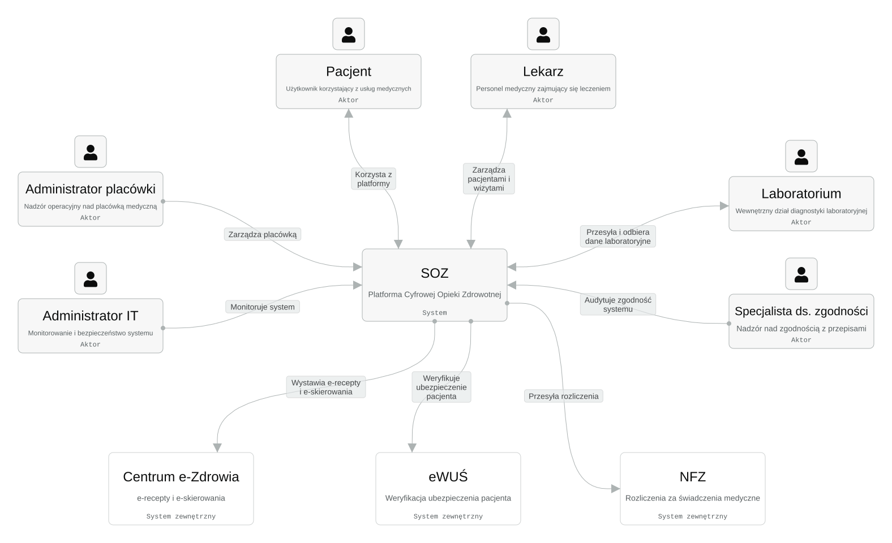
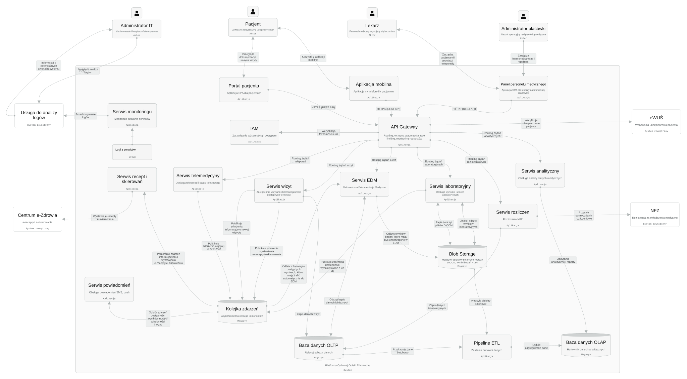
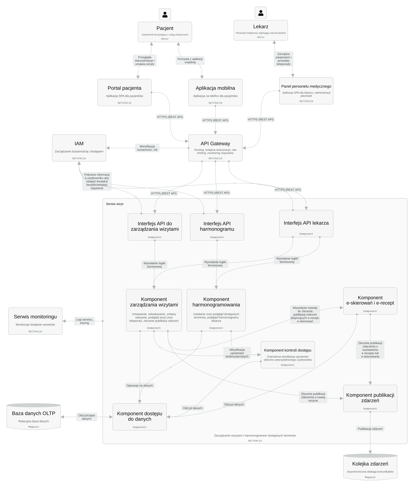
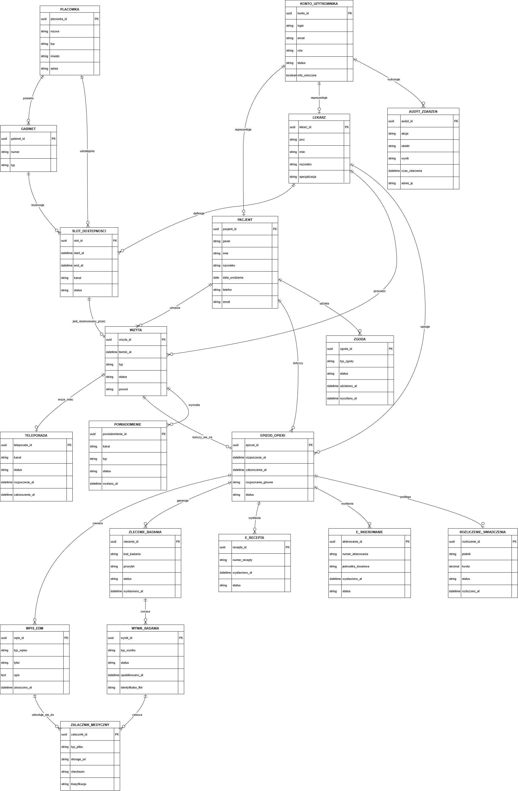

<style>
  @page { margin: 12mm; }
  /* table { page-break-inside: avoid; break-inside: avoid; } */
  pre, code { page-break-inside: avoid; break-inside: avoid; }
  blockquote { page-break-inside: avoid; break-inside: avoid; }
  h1, h2, h3, h4 { page-break-after: avoid; break-after: avoid; }
</style>

# Realizacja projektu - System Opieki Zdrowotnej (SOZ)

|                      |        |
| -------------------- | ------ |
| Jakub Kieruczenko    | 318669 |
| Aleksander Stanoch   | 325230 |
| Sebastian Abramowski | 325142 |
| Kazimierz Lipski     | 310800 |

---

<div style="page-break-after: always;" />

## 1. Analiza wymagań

### 1.1 Aktorzy systemu i ich problemy

| Aktor                         | Rola w systemie                                                                                                            | Główne problemy / oczekiwania                                                                                                                                                                                                               |
| ----------------------------- | -------------------------------------------------------------------------------------------------------------------------- | ------------------------------------------------------------------------------------------------------------------------------------------------------------------------------------------------------------------------------------------- |
| **Pacjent**                   | Użytkownik systemu korzystający z usług medycznych                                                                         | Brak wglądu we własną dokumentację medyczną; konieczność osobistego umawiania wizyt; brak możliwości konsultacji lekarskich bez wychodzenia z domu                                                                                          |
| **Lekarz**                    | Użytkownik systemu zajmujący się leczeniem pacjentów                                                                       | Brak dostępu do historii leczenia pacjenta z innych placówek; konieczność ręcznego prowadzenia dokumentacji medycznej; brak bezpośredniego dostępu do wyników badań pacjentów, w tym badań obrazowych; brak możliwości udzielania teleporad |
| **Laboratorium**              | Dostarczyciel wyników badań                                                                                                | Brak zautomatyzowanego przekazywania wyników badań (papierowe lub mailowe); brak integracji z EDM pacjenta; brak możliwości przeglądania statystyk dotyczących wykonanych badań                                                             |
| **Administrator placówki**    | Użytkownik systemu posiadający wgląd operacyjny w funkcjonowanie placówki (wizyty, pacjenci, harmonogram)                  | Brak centralnego wglądu w harmonogram wizyt; trudności w zarządzaniu rejestracją pacjentów; brak możliwości generowania raportów dotyczących funkcjonowania placówki                                                                        |
| **Administrator IT**          | Użytkownik odpowiedzialny za monitorowanie działania systemu w środowisku produkcyjnym oraz utrzymanie jego bezpieczeństwa | Brak możliwości monitorowania działania systemu w czasie rzeczywistym; brak narzędzi do szybkiego wykrywania i diagnozowania błędów; brak automatycznych powiadomień o awariach                                                             |
| **Specjalista ds. zgodności** | Osoba odpowiedzialna za nadzór nad zgodnością systemu z przepisami i politykami bezpieczeństwa                             | Brak możliwości weryfikacji zgodności działania systemu z obowiązującymi przepisami prawa; brak narzędzi do wykazania spełnienia wymogów regulacyjnych                                                                                      |

<div style="page-break-after: always;" />

### 1.2 Zewnętrzne systemy publiczne

| System zewnętrzny     | Cel integracji                               |
| --------------------- | -------------------------------------------- |
| **Centrum e-Zdrowia** | Obsługa e-recept oraz e-skierowań            |
| **eWUŚ**              | Możliwość weryfikacji ubezpieczenia pacjenta |
| **NFZ**               | Rozliczanie świadczeń medycznych             |

---

### 1.3 Wymagania funkcjonalne

#### F0 – Sposób dostępu do systemu

| ID   | Wymaganie                                                                                                                                 |
| ---- | ----------------------------------------------------------------------------------------------------------------------------------------- |
| F0.1 | System powinien umożliwiać pacjentowi korzystanie z funkcjonalności systemu za pośrednictwem portalu internetowego lub aplikacji mobilnej |
| F0.2 | System powinien umożliwiać pozostałym użytkownikom korzystanie z systemu za pośrednictwem portalu internetowego                           |

#### F1 – Zarządzanie wizytami

| ID   | Wymaganie                                                                                                                                      |
| ---- | ---------------------------------------------------------------------------------------------------------------------------------------------- |
| F1.1 | System powinien umożliwiać pacjentowi umawianie i odwoływanie wizyt                                                                            |
| F1.2 | System powinien umożliwiać pacjentowi podgląd dostępnych terminów wizyt dla wybranych lekarzy i przychodni                                     |
| F1.3 | System powinien wysyłać pacjentowi automatyczne przypomnienia o nadchodzącej wizycie za pomocą wiadomości SMS                                  |
| F1.4 | System powinien umożliwiać użytkownikom posiadającym odpowiednie uprawnienia podgląd szczegółów wizyty (data, godzina, gabinet, dane pacjenta) |
| F1.5 | System powinien umożliwiać lekarzowi podgląd dziennego harmonogramu wizyt                                                                      |
| F1.6 | System powinien umożliwiać lekarzowi zmianę statusu wizyty                                                                                     |
| F1.7 | System powinien umożliwiać lekarzowi definiowanie dostępnych terminów wizyt                                                                    |

<div style="page-break-after: always;" />

#### F2 – Telemedycyna

| ID   | Wymaganie                                                                                                    |
| ---- | ------------------------------------------------------------------------------------------------------------ |
| F2.1 | System powinien umożliwiać pacjentowi kontakt z lekarzem poprzez czat tekstowy                               |
| F2.2 | System powinien umożliwiać przesyłanie załączników w ramach komunikacji czatowej między pacjentem a lekarzem |
| F2.3 | System powinien umożliwiać pacjentowi umawianie wizyt w formie teleporad                                     |
| F2.4 | System powinien umożliwiać lekarzowi dostęp do EDM pacjenta                                                  |
| F2.5 | System powinien umożliwiać lekarzowi wystawianie e-recept oraz e-skierowań w ramach konsultacji              |

#### F3 – Elektroniczna Dokumentacja Medyczna (EDM)

| ID   | Wymaganie                                                                                                                                   |
| ---- | ------------------------------------------------------------------------------------------------------------------------------------------- |
| F3.1 | System powinien umożliwiać przechowywanie ujednoliconej dokumentacji medycznej pacjenta w ramach EDM                                        |
| F3.2 | System powinien umożliwiać lekarzowi tworzenie, edytowanie i przeglądanie EDM pacjenta                                                      |
| F3.3 | System powinien umożliwiać pacjentowi przeglądanie i pobieranie fragmentów EDM przypisanej do niego                                         |
| F3.4 | System powinien rejestrować historię zmian oraz dostępów do EDM, wraz z informacją o użytkowniku i czasie wykonania operacji oraz jej typie |
| F3.5 | System powinien umożliwiać przechowywanie i przeglądanie załączników z wynikami badań w ramach EDM w formatach PDF oraz DICOM               |
| F3.6 | System powinien umożliwiać pacjentowi aktualizację jego danych osobowych                                                                    |

#### F4 – Integracja laboratoryjna

| ID   | Wymaganie                                                                                                                                                          |
| ---- | ------------------------------------------------------------------------------------------------------------------------------------------------------------------ |
| F4.1 | System powinien umożliwiać laboratorium przesyłanie wyników badań bezpośrednio do EDM pacjenta w formatach PDF oraz DICOM                                          |
| F4.2 | System powinien powiadamiać pacjenta o dostępności wyników badań za pomocą wiadomości SMS                                                                          |
| F4.3 | System powinien umożliwiać lekarzowi wystawianie zleceń badań laboratoryjnych dla pacjenta                                                                         |
| F4.4 | System powinien umożliwiać wyszukiwanie zleceń badań laboratoryjnych na podstawie ich identyfikatora                                                               |
| F4.5 | System powinien umożliwiać pacjentowi podgląd i pobieranie wyników badań laboratoryjnych (format PDF, DICOM) na podstawie numeru PESEL oraz identyfikatora badania |

#### F5 – Analityka i raportowanie

| ID   | Wymaganie                                                                                                        |
| ---- | ---------------------------------------------------------------------------------------------------------------- |
| F5.1 | System powinien umożliwiać generowanie statystyk dotyczących liczby i rodzaju wykonanych badań laboratoryjnych   |
| F5.2 | System powinien umożliwiać administratorowi przychodni generowanie statystyk dotyczących liczby wizyt            |
| F5.3 | System powinien umożliwiać administratorowi przychodni wizualizację zajętości gabinetów                          |
| F5.4 | System powinien umożliwiać administratorowi przychodni podgląd zaplanowanych wizyt w konkretnych placówkach      |
| F5.5 | System powinien umożliwiać generowanie raportów świadczeń medycznych zgodnie ze standardami wymaganymi przez NFZ |

#### F6 – Bezpieczeństwo

| ID   | Wymaganie                                                                                               |
| ---- | ------------------------------------------------------------------------------------------------------- |
| F6.1 | System powinien dostosowywać dostęp do funkcji i widoków w zależności od przypisanej użytkownikowi roli |
| F6.2 | System powinien wymagać uwierzytelniania dwuskładnikowego (MFA) dla użytkowników innych niż pacjent     |
| F6.3 | System powinien automatycznie wylogowywać użytkownika po określonym czasie bezczynności                 |

---

### 1.4 Wymagania niefunkcjonalne

#### NF1 - Zgodność i ochrona danych

| ID    | Wymaganie                                                                                                                          |
| ----- | ---------------------------------------------------------------------------------------------------------------------------------- |
| NF1.1 | System powinien zapewniać dostęp do EDM pacjenta wyłącznie uprawnionym użytkownikom                                                |
| NF1.2 | System powinien zapewniać bezpieczeństwo danych poprzez szyfrowanie komunikacji oraz ochronę danych przechowywanych w bazie danych |
| NF1.3 | System powinien przetwarzać wyłącznie dane pacjenta niezbędne do realizacji usług medycznych                                       |
| NF1.4 | System powinien zapewniać przetwarzanie danych medycznych wyłącznie w celach związanych z udzielaniem świadczeń zdrowotnych        |
| NF1.5 | System powinien umożliwiać przechowywanie EDM przez wymagany okres czasu                                                           |
| NF1.6 | System powinien zapewniać przechowywanie EDM w sposób gwarantujący jej integralność, kompletność oraz możliwość odtworzenia        |

<div style="page-break-after: always;" />

#### NF2 – Monitorowanie systemu

| ID    | Wymaganie                                                                                 |
| ----- | ----------------------------------------------------------------------------------------- |
| NF2.1 | System powinien zapewniać możliwość monitorowania swojego działania w czasie rzeczywistym |
| NF2.2 | System powinien umożliwiać monitorowanie obciążenia systemu                               |
| NF2.3 | System powinien umożliwiać szybkie wykrywanie i diagnozowanie błędów                      |
| NF2.4 | System powinien automatycznie powiadamiać administratora IT o awariach systemu            |

#### NF3 - Utrzymywalność

| ID    | Wymaganie                                                                                                             |
| ----- | --------------------------------------------------------------------------------------------------------------------- |
| NF3.1 | System powinien umożliwiać wdrażanie aktualizacji wybranych komponentów bez przerywania działania systemu             |
| NF3.2 | System powinien być wdrażany i utrzymywany w odrębnych środowiskach: deweloperskim, preprodukcyjnym oraz produkcyjnym |

#### NF4 - Dostępność i niezawodność

| ID    | Wymaganie                                                  | Wartość docelowa                                                           |
| ----- | ---------------------------------------------------------- | -------------------------------------------------------------------------- |
| NF4.1 | Dostępność systemu (SLA)                                   | ≥ 99.5% (dopuszczalne są planowane przerwy techniczne w godzinach nocnych) |
| NF4.2 | RTO (Recovery Time Objective) – czas odtworzenia po awarii | ≤ 4 godziny                                                                |
| NF4.3 | RPO (Recovery Point Objective) – maksymalna utrata danych  | ≤ 1 godzina                                                                |

#### NF5 – Wydajność i skalowalność

| ID    | Wymaganie                                                                                    | Wartość docelowa |
| ----- | -------------------------------------------------------------------------------------------- | ---------------- |
| NF5.1 | System powinien zapewniać krótki czas odpowiedzi dla podstawowych operacji                   | ≤ 1 s            |
| NF5.2 | System powinien zapewniać szybkie ładowanie interfejsu użytkownika                           | ≤ 3 s            |
| NF5.3 | System powinien obsługiwać zwiększoną liczbę użytkowników bez zauważalnego spadku wydajności | -                |

<div style="page-break-after: always;" />

#### NF6 – Interoperacyjność

| ID    | Wymaganie                                                                                      |
| ----- | ---------------------------------------------------------------------------------------------- |
| NF6.1 | System powinien umożliwiać przesyłanie danych EDM w formacie zgodnym ze standardem HL7 FHIR R4 |
| NF6.2 | System powinien umożliwiać przechowywanie i przeglądanie danych obrazowych w formacie DICOM    |

---

### 1.5 Szacowanie skali systemu (Back of Envelope)

Poniższe oszacowanie ma wyznaczyć rząd wielkości systemu, a nie precyzyjną prognozę biznesową. Punktem wyjścia są dane z treści zadania: sieć obejmuje **5 szpitali i 20 przychodni**. Pozostałe liczby są jawnymi założeniami operacyjnymi przyjętymi dla typowego dnia roboczego, tak aby oszacowanie było spójne z aktualnymi wymaganiami: portal pacjenta, EDM, teleporady oparte o czat i załączniki, integracja laboratoryjna oraz obrazy DICOM.

#### Założenia bazowe

| Parametr                                 | Wartość                         | Uzasadnienie                                                   |
| ---------------------------------------- | ------------------------------- | -------------------------------------------------------------- |
| Placówki                                 | 25 (5 szpitali + 20 przychodni) | Dane z treści zadania                                          |
| Wizyty w przychodni                      | 120 / dzień / placówkę          | Rząd wielkości dla kilku aktywnych gabinetów w trybie dziennym |
| Wizyty ambulatoryjne w szpitalu          | 180 / dzień / placówkę          | Poradnie przyszpitalne, konsultacje i kontrola pacjentów       |
| Dni robocze dla ruchu ambulatoryjnego    | 250 / rok                       | Uproszczone założenie do obliczeń rocznych                     |
| Udział teleporad                         | 8% wszystkich wizyt             | Teleporada istnieje w wymaganiach, ale bez wideopołączeń       |
| Wizyty kończące się zleceniem badań lab. | 35%                             | Nie każda konsultacja generuje badania                         |
| Wizyty kończące się badaniem obrazowym   | 8%                              | DICOM dotyczy tylko części procesu diagnostycznego             |
| Aktywne konta pacjentów                  | ~300 000                        | Rząd wielkości dla grupy placówek tej skali                    |
| Aktywne konta personelu i administracji  | ~4 000                          | Lekarze, rejestracja, laboratoria, administratorzy             |

<div style="page-break-after: always;" />

#### Skala obsługiwanych wizyt

```
Przychodnie:                    20 x 120  = 2 400 wizyt / dzień
Szpitale (ambulatoryjnie):       5 x 180  =   900 wizyt / dzień
Łącznie:                                    3 300 wizyt / dzień

Wizyty rocznie:                 3 300 x 250 = ~825 000
Teleporady dziennie:            8% z 3 300   = ~260
```

#### Ruch użytkowników i obciążenie aplikacji

```
Dziennie aktywnych pacjentów:   ~4 000
Dziennie aktywnego personelu:   ~2 500
Łącznie DAU:                    ~6 500

Szczyt jednoczesnych sesji:     ~1 000
Nominalny ruch API:             ~80 req/s   (1 000 sesji, średnio 1 akcja / 12 s)
Ruch szczytowy z zapasem:       200-250 req/s
```

Taki poziom obciążenia jest spójny z wymaganiami niefunkcjonalnymi: czas odpowiedzi podstawowych operacji do 1 s i czas ładowania interfejsu do 3 s. System nie powinien być projektowany "na styk", tylko z zapasem na poranne i popołudniowe piki rejestracji, publikację wyników oraz wysyłkę powiadomień.

#### Dane transakcyjne i EDM

```
Rekord wizyty:                  ~6 KB
Przyrost danych wizyt / rok:    825 000 x 6 KB  = ~5 GB

Wpisy EDM i notatki:            średnio 3 wpisy po 25 KB / wizytę
Przyrost EDM / rok:             825 000 x 75 KB = ~60 GB

Dane pacjentów i słowniki:      rząd wielkości pojedynczych GB
```

Same rekordy relacyjne nie są duże; przestrzeń dyskową w systemie ochrony zdrowia zużywają głównie załączniki medyczne, pliki PDF i obrazy DICOM, a nie tabele transakcyjne.

<div style="page-break-after: always;" />

#### Wyniki laboratoryjne

```
Zlecenia lab. dziennie:         35% z 3 300     = ~1 155
Wyniki na jedno zlecenie:       średnio 3
Pakiety wyników dziennie:       ~3 465
Średni rozmiar pakietu:         ~0.5 MB (PDF + metadane)

Przyrost danych / dzień:        ~1.7 GB
Przyrost danych / rok:          ~0.4 TB
```

#### Dane – obrazowanie medyczne (DICOM)

```
Badania obrazowe dziennie:      8% z 3 300      = ~260
Średni rozmiar badania:         ~60 MB
Przyrost danych / dzień:        ~15.6 GB
Przyrost danych / rok:          ~3.9 TB
```

#### Telemedycyna

```
Teleporady dziennie:            ~260
Wiadomości na teleporadę:       średnio 20
Wiadomości czatowe / dzień:     ~5 200
Załączniki / teleporadę:        średnio 2 po 1 MB
Przyrost załączników / rok:     ~0.13 TB
```

#### Całkowite zapotrzebowanie na przestrzeń dyskową (horyzont 3 lat)

| Kategoria danych                     | Rozmiar (3 lata) |
| ------------------------------------ | ---------------- |
| Obrazowanie medyczne (DICOM)         | ~11.7 TB         |
| Wyniki laboratoryjne                 | ~1.2 TB          |
| Załączniki z teleporad i komunikacji | ~0.4 TB          |
| Rekordy wizyt i EDM                  | ~0.2 TB          |
| Logi, kopie zapasowe, metadane       | ~4.5 TB          |
| **Łącznie**                          | **~18 TB**       |

<div style="page-break-after: always;" />

#### Podsumowanie – kluczowe parametry projektowe

| Parametr                      | Wartość           |
| ----------------------------- | ----------------- |
| Użytkownicy (łącznie)         | ~304 000          |
| Szczyt jednoczesnych sesji    | ~1 000            |
| Szczyt API req/s              | ~200-250          |
| Dane do przechowania (3 lata) | ~18 TB            |
| Roczny przyrost danych        | ~6 TB/rok         |
| Model teleporady              | czat + załączniki |
| Wymagana dostępność           | 99.5%             |

> Powyższe obliczenia wskazują, że system należy projektować przede wszystkim pod retencję danych medycznych, audyt i przechowywanie obrazów DICOM. Największym obciążeniem pojemnościowym są pliki diagnostyczne, a nie ruch telemedyczny, ponieważ obecne wymagania obejmują czat i załączniki zamiast połączeń wideo.

## 2. Analiza wymagań

### 2.1 Diagram kontekstu



<div style="page-break-after: always;" />

### 2.2 Diagram kontenerów



<div style="page-break-after: always;" />

### 2.3 Diagram komponentów - usługa umawiania wizyt



<div style="page-break-after: always;" />

### 2.4 Diagram wdrożenia


<div style="page-break-after: always;" />

### Decyzje architektoniczne

1. **Dwa regiony chmurowe (Polska Środkowa i Europa Zachodnia)**
   Dane medyczne objęte są przepisami RODO (Rozporządzenie o Ochronie Danych Osobowych) oraz wymogami Narodowego Funduszu Zdrowia dotyczącymi lokalizacji przechowywania danych — region podstawowy musi znajdować się w Polsce. Drugi region pełni rolę środowiska odtwarzania po awarii i zapewnia parametry ciągłości działania: cel punktu odtwarzania (RPO — maksymalna dopuszczalna utrata danych w razie awarii) oraz cel czasu odtwarzania (RTO — maksymalny czas, po którym system musi być ponownie dostępny) zgodne z wymaganiami systemu krytycznego. Baza danych i magazyn plików są na bieżąco replikowane geograficznie do regionu zapasowego. W regionie zapasowym działa klaster kontenerów w trybie uśpienia (standby) — jest uruchomiony, ale utrzymuje minimalną liczbę instancji usług (np. jedną zamiast trzech na strefę). Gdyby klaster był całkowicie wyłączony, jego uruchomienie po awarii zajęłoby kilkanaście minut (tworzenie węzłów obliczeniowych, pobieranie obrazów kontenerów z rejestru). Tryb uśpienia skraca czas przełączenia do sekund: globalna brama sieciowa (Azure Front Door) stale sprawdza dostępność regionu podstawowego i w razie wykrycia awarii automatycznie kieruje cały ruch do regionu zapasowego, który natychmiast doskalowuje się do pełnej liczby instancji. Koszt tego rozwiązania to stały wydatek na utrzymanie uśpionych węzłów obliczeniowych — jest to świadoma decyzja kupowania krótszego czasu odtwarzania kosztem wyższych wydatków operacyjnych.

2. **Zarządzany klaster kontenerów z trzema strefami dostępności**
   Kontener to odizolowana jednostka uruchomieniowa zawierająca kod usługi wraz z jej zależnościami — lżejsza od maszyny wirtualnej i przenośna między środowiskami. Zarządzanie dużą liczbą kontenerów (uruchamianie, restartowanie po awarii, równoważenie obciążenia) wymaga platformy orkiestracji; pełni ją Kubernetes — oprogramowanie open-source pierwotnie opracowane przez Google. Usługa zarządzanych kontenerów Azure (_Azure Kubernetes Service_) dostarcza gotowy, zarządzany przez dostawcę klaster Kubernetes. Rozmieszcza mikroserwisy równomiernie w trzech niezależnych strefach dostępności w obrębie jednego regionu (fizycznie oddzielnych centrach danych), eliminując pojedynczy punkt awarii. Kubernetes automatycznie skaluje liczbę uruchomionych instancji w zależności od bieżącego obciążenia (np. wzrost liczby wizyt w sezonie grypowym).

3. **Strefa zdemilitaryzowana jako bufor między Internetem a usługami wewnętrznymi**
   Strefa zdemilitaryzowana (DMZ) to wyodrębniony segment sieci, który stoi między publicznym Internetem a wewnętrzną siecią chronioną. Do strefy DMZ trafia cały ruch przychodzący z zewnątrz — ale nie może on stamtąd bezpośrednio dotrzeć do bazy danych ani kontenerów z logiką biznesową. Reguły zapory sieciowej pozwalają na przepływ w jednym kierunku: z Internetu do DMZ, i z DMZ do sieci wewnętrznej — nigdy bezpośrednio z Internetu do środka. W praktyce oznacza to, że nawet jeśli atakującemu uda się skompromitować komponent w strefie DMZ (np. równoważnik obciążenia), nadal napotka kolejną barierę przed dostępem do danych medycznych. W architekturze systemu w strefie DMZ umieszczono dwa komponenty. Pierwszym jest **Azure Application Gateway** — zarządzany równoważnik obciążenia warstwy siódmej (najwyższej warstwy modelu sieciowego OSI, odpowiedzialnej za protokół HTTP). Rozumie treść żądań HTTP, dzięki czemu może trasować ruch na podstawie ścieżki adresu (np. `/wizyty/*` do serwisu wizyt, `/lab/*` do serwisu laboratoryjnego) i rozdzielać go równomiernie między węzły klastra. Drugim jest **Azure API Management** (skr. APIM) — zarządzana brama interfejsów programistycznych odpowiedzialna za uwierzytelnianie, ograniczanie liczby żądań i trasowanie ruchu do właściwych usług; opisana szczegółowo w punkcie 5.

4. **Globalna brama sieciowa z siecią dostarczania treści i zaporą aplikacyjną**
   Azure Front Door to usługa brzegowa Microsoftu działająca w ponad 100 lokalizacjach na całym świecie. Pełni trzy role jednocześnie. Po pierwsze, jest globalnym punktem wejścia dla ruchu użytkowników — kieruje każde żądanie do najbliższego, zdrowego centrum danych zaplecza, skracając czas odpowiedzi. Po drugie, pełni rolę sieci dostarczania treści (skr. CDN — _Content Delivery Network_): statyczne zasoby interfejsu użytkownika (skrypty, style, obrazy) są kopiowane na serwery brzegowe rozmieszczone blisko użytkowników końcowych, dzięki czemu przeglądarka pobiera je z odległości setek, a nie tysięcy kilometrów. Po trzecie, wbudowana zapora aplikacji webowych (skr. WAF — _Web Application Firewall_) analizuje każde żądanie HTTP i blokuje znane wzorce ataków — wstrzykiwanie kodu SQL, ataki skryptowe czy próby nieuprawnionego dostępu — zanim żądanie dotrze do klastra. Jest to wymagane dla systemów przetwarzających dane medyczne zgodnie z normą bezpieczeństwa informacji ISO/IEC 27001.

5. **Zarządzanie interfejsem programistycznym i tożsamością**
   Interfejs programistyczny (skr. API — _Application Programming Interface_) to zdefiniowany zestaw reguł określający, jak aplikacje mogą się ze sobą komunikować. Brama interfejsów programistycznych Azure API Management stanowi jeden punkt wejścia dla wszystkich wywołań kierowanych do mikroserwisów. Centralizuje: uwierzytelnianie z użyciem protokołu OAuth 2.0 (otwarty standard autoryzacji oparty na tokenach) i nakładki tożsamości OpenID Connect, ograniczanie liczby żądań na użytkownika lub klienta, trasowanie wywołań do właściwych usług zaplecza oraz rejestr wszystkich wywołań na potrzeby audytu. Zarządzanie tożsamością i dostępem (skr. IAM — _Identity and Access Management_) to ogólna warstwa kontroli uprawnień: decyduje, który użytkownik lub usługa może wykonać daną operację.

6. **Zarządzana kolejka komunikatów**
   Mikroserwisy mogą komunikować się synchronicznie (jeden czeka na odpowiedź drugiego) lub asynchronicznie (jeden wysyła wiadomość i nie czeka). Komunikacja asynchroniczna jest odporniejsza na chwilowe niedostępności odbiorcy. Azure Service Bus to zarządzana usługa kolejkowania komunikatów: producent (np. serwis wizyt) umieszcza zdarzenie w kolejce, konsument (np. serwis powiadomień) odbiera je wtedy, gdy jest gotowy. Usługa gwarantuje dostarczenie każdej wiadomości przynajmniej raz, przechowuje je trwale na dysku oraz kieruje niedoręczone komunikaty do osobnej kolejki awaryjnej w celu późniejszej analizy.

7. **Pamięć podręczna dla danych często odczytywanych**
   Pamięć podręczna (skr. cache) to szybki magazyn tymczasowy przechowujący wyniki kosztownych zapytań do bazy danych, by nie powtarzać ich przy każdym żądaniu. Azure Cache for Redis jest zarządzaną instancją bazy Redis — magazynu danych działającego w pamięci operacyjnej, wielokrotnie szybszego od dyskowej bazy relacyjnej.

8. **Warstwa analityczna odizolowana od systemu transakcyjnego**
   Baza transakcyjna (skr. OLTP — _Online Transaction Processing_, czyli przetwarzanie transakcji on-line) jest zoptymalizowana pod kątem szybkich zapisów i odczytów pojedynczych rekordów. Uruchamianie na niej złożonych zapytań analitycznych (np. trendy zachorowań, obłożenie placówek) spowolniłoby pracę lekarzy i pacjentów. Dlatego dane są kopiowane potokiem przetwarzania (skr. ETL — _Extract, Transform, Load_, czyli wyodrębnij, przekształć, załaduj) do osobnej analitycznej bazy kolumnowej (skr. OLAP — _Online Analytical Processing_, czyli analityczne przetwarzanie on-line) Azure Synapse Analytics. Jest to zarządzana usługa Microsoftu łącząca w jednym produkcie magazyn danych analitycznych i silnik potoków przetwarzania — eliminuje potrzebę osobnych narzędzi do transformacji i przechowywania danych analitycznych. Bazy kolumnowe przechowują dane pogrupowane według kolumn, a nie wierszy, co drastycznie przyspiesza agregacje na milionach rekordów.
   Warstwa analityczna nie posiada kopii w regionie zapasowym, ponieważ zawiera wyłącznie dane pochodne — wyliczone z danych transakcyjnych, które są replikowane. W razie awarii regionu podstawowego dane analityczne można odtworzyć, uruchamiając ponownie potok przetwarzania na replikowanej bazie transakcyjnej. Jest to akceptowalna utrata, gdyż wykresy i raporty nie są niezbędne do ratowania życia — priorytetem przełączenia awaryjnego jest przywrócenie dostępu do dokumentacji medycznej i możliwości umawiania wizyt. Replikowanie dziesiątek terabajtów danych analitycznych byłoby ponadto bardzo kosztowne i nieproporcjonalne do osiągniętej korzyści.

9. **Wzajemne uwierzytelnianie przy integracjach zewnętrznych**
   Standardowe szyfrowanie transmisji (skr. TLS — _Transport Layer Security_, czyli bezpieczeństwo warstwy transportowej) chroni dane przed podsłuchem, ale weryfikuje tożsamość wyłącznie serwera. Wzajemny protokół uwierzytelniania (skr. mTLS — _mutual TLS_) wymaga, by obie strony połączenia — zarówno klient, jak i serwer — potwierdziły swoją tożsamość certyfikatem cyfrowym. Połączenia z systemami zewnętrznymi — Narodowym Funduszem Zdrowia, systemem Elektronicznej Weryfikacji Uprawnień Świadczeniobiorców (eWUŚ) oraz Centrum e-Zdrowia — realizowane są właśnie z użyciem wzajemnego uwierzytelniania, co uniemożliwia podszycie się pod uprawniony system nawet w przypadku wycieku adresu sieciowego usługi.

### 2.5 Diagram encji/klas

Najważniejsze założenia modelu danych:

- **Pacjent** jest centralną encją domenową i posiada powiązania z wizytami, epizodami opieki, wynikami badań, zgodami oraz powiadomieniami.
- **Wizyta** reprezentuje rezerwację terminu i może mieć charakter stacjonarny lub zdalny; dla teleporady tworzona jest powiązana encja **Teleporada**.
- **Epizod opieki** reprezentuje faktyczne zdarzenie medyczne powstałe w wyniku wizyty i stanowi kontener dla wpisów EDM, recept, skierowań oraz zleceń badań.
- **Wyniki badań**, dokumenty PDF i obrazy DICOM są modelowane oddzielnie od wpisów EDM, aby uprościć integrację z laboratoriami i systemami obrazowania.
- **Audyt zdarzeń** oraz **zgody pacjenta** zostały wydzielone jako osobne encje ze względu na wymagania RODO, śledzenie dostępu do EDM oraz rozliczalność operacji.

<div style="page-break-after: always;" />



<div style="page-break-after: always;" />

## 3. Wybór technologii

### 3.1 Frontend

| Obszar                | Technologia               | Uzasadnienie                                                                                                                                                   |
| --------------------- | ------------------------- | -------------------------------------------------------------------------------------------------------------------------------------------------------------- |
| Portal webowy         | **React 18** (TypeScript) | Duży ekosystem bibliotek ułatwia implementację interfejsu użytkownika i integrację z API; TypeScript zmniejsza ryzyko błędów typów w złożonym modelu domenowym |
| Aplikacja mobilna     | **React Native**          | Współdzielenie logiki biznesowej, typów danych i wybranych komponentów z portalem webowym; umożliwia rozwój obu aplikacji przez jeden zespół frontendowy       |
| Obsługa obrazów DICOM | **Cornerstone.js**        | Biblioteka open-source umożliwiająca przeglądanie obrazów medycznych w formacie DICOM bezpośrednio w przeglądarce                                              |
| Czat telemedyczny     | **@microsoft/signalr**    | Oficjalny klient JavaScript dla ASP.NET Core SignalR; kompatybilny protokołowo z backendem .NET i przeznaczony do komunikacji w czasie rzeczywistym            |

### 3.2 Backend

| Obszar                             | Technologia                   | Uzasadnienie                                                                                                                                                                                                                                                 |
| ---------------------------------- | ----------------------------- | ------------------------------------------------------------------------------------------------------------------------------------------------------------------------------------------------------------------------------------------------------------ |
| Mikroserwisy domenowe              | **.NET 10 (C#)**              | Wysoka wydajność środowiska uruchomieniowego, bogaty ekosystem bibliotek medycznych oraz wsparcie dla standardów takich jak HL7 FHIR (Firely .NET SDK), silne typowanie i dojrzałe narzędzia diagnostyczne; spójna platforma dla całego zespołu backendowego |
| Brama API                          | **Azure API Management**      | Zarządzany produkt chmurowy eliminujący utrzymanie własnej bramy; centralizuje uwierzytelnianie i wstępną autoryzację żądań kierowanych do mikroserwisów                                                                                                     |
| Równoważenie obciążenia            | **Azure Application Gateway** | Rozdziela ruch pomiędzy instancje mikroserwisów, zwiększając dostępność i niezawodność systemu                                                                                                                                                               |
| Usługa czatu telemedycznego        | **SignalR** (ASP.NET Core)    | Natywna integracja z ekosystemem .NET; umożliwia implementację czatu telemedycznego i komunikacji w czasie rzeczywistym                                                                                                                                      |
| Przetwarzanie zleceń i powiadomień | **MassTransit**               | Abstrakcja nad Azure Service Bus ułatwiająca implementację i obsługę komunikacji asynchronicznej pomiędzy mikroserwisami                                                                                                                                     |

<div style="page-break-after: always;" />

### 3.3 Integracja

| Obszar                                | Technologia / Standard                   | Uzasadnienie                                                                                                             |
| ------------------------------------- | ---------------------------------------- | ------------------------------------------------------------------------------------------------------------------------ |
| Wymiana danych EDM między systemami   | **HL7 FHIR R4** (REST API)               | Wymaganie NF6.1; standard wskazany przez Centrum e-Zdrowia dla integracji systemów ochrony zdrowia w Polsce              |
| Zarządzanie obrazami medycznymi       | **DICOMweb**                             | Wymaganie NF6.2 i F3.5; standard umożliwiający przesyłanie i pobieranie badań obrazowych w formacie DICOM przez REST API |
| e-Recepty i e-Skierowania             | REST API **Centrum e-Zdrowia**           | Obowiązkowy punkt integracji; uwierzytelnianie mTLS z certyfikatem wydanym przez Centrum e-Zdrowia                       |
| Weryfikacja ubezpieczenia             | REST API **eWUŚ**                        | Weryfikacja uprawnień pacjenta w trakcie rejestracji wizyty; mTLS                                                        |
| Rozliczenia świadczeń                 | SOAP API **NFZ**                         | Przekazywanie raportów rozliczeniowych do NFZ; mTLS                                                                      |
| Asynchroniczna komunikacja wewnętrzna | **Azure Service Bus** (kolejki i tematy) | Zarządzana usługa komunikacji asynchronicznej pomiędzy mikroserwisami zintegrowana z ekosystemem Azure                   |
| Powiadomienia SMS                     | **Azure Communication Services**         | Zarządzana usługa chmurowa umożliwiająca wysyłanie powiadomień SMS; zintegrowana z ekosystemem Azure                     |

<div style="page-break-after: always;" />

### 3.4 Bazy danych i przechowywanie danych

| Rodzaj danych                                          | Technologia                                            | Uzasadnienie                                                                                                                                                             |
| ------------------------------------------------------ | ------------------------------------------------------ | ------------------------------------------------------------------------------------------------------------------------------------------------------------------------ |
| Dane transakcyjne (wizyty, EDM, użytkownicy, zlecenia) | **Azure Database for PostgreSQL**                      | Relacyjna baza danych ACID zapewniająca spójność danych transakcyjnych; natywna replikacja geograficzna do regionu zapasowego; obsługa JSONB dla elastycznych wpisów EDM |
| Pliki binarne (PDF, DICOM, załączniki czatu)           | **Azure Blob Storage** (tier Hot / Cool / Archive)     | Obiekty o dowolnym rozmiarze; automatyczne przenoszenie do tańszych tierów na podstawie wieku pliku (lifecycle management); geograficzna replikacja RA-GRS               |
| Pamięć podręczna                                       | **Azure Cache for Redis** (tier Standard z replikacją) | Magazyn in-memory o niskich opóźnieniach; cache wyników często wykonywanych zapytań wymagających szybkiego dostępu                                                       |
| Dane analityczne                                       | **Azure Synapse Analytics**                            | Kolumnowe przechowywanie danych zoptymalizowane pod agregacje; natywna integracja z Power BI                                                                             |

### 3.5 Analityka i raportowanie

| Komponent            | Technologia                 | Uzasadnienie                                                                                                                                                                 |
| -------------------- | --------------------------- | ---------------------------------------------------------------------------------------------------------------------------------------------------------------------------- |
| Warstwa analityczna  | **Azure Synapse Analytics** | Zarządzany magazyn danych kolumnowych; integruje silnik ETL (Synapse Pipelines) i środowisko zapytań SQL w jednym produkcie                                                  |
| Potok ETL            | **Synapse Pipelines**       | Orkiestracja transferu danych z PostgreSQL do Synapse; harmonogramowane i wyzwalane przepływy danych                                                                         |
| Dashboardy i raporty | **Power BI Embedded**       | Natywna integracja z Azure Synapse; możliwość osadzenia raportów bezpośrednio w portalu administracyjnym bez logowania do zewnętrznego narzędzia; dostępne szablony raportów |

<div style="page-break-after: always;" />

### 3.6 Infrastruktura i hosting

| Komponent                             | Technologia                                                         | Uzasadnienie                                                                                                                                                                                                                   |
| ------------------------------------- | ------------------------------------------------------------------- | ------------------------------------------------------------------------------------------------------------------------------------------------------------------------------------------------------------------------------ |
| Orkiestracja kontenerów               | **Azure Kubernetes Service (AKS)**                                  | Zarządzana platforma do uruchamiania i skalowania mikroserwisów kontenerowych zintegrowana z ekosystemem Azure                                                                                                                 |
| Globalny punkt wejścia i CDN          | **Azure Front Door** z modułem WAF                                  | Zapewnia szybki i niezawodny dostęp do systemu dla użytkowników z różnych lokalizacji, automatyczne przełączanie ruchu w przypadku awarii regionu oraz dodatkową, podstawową ochronę aplikacji przed typowymi atakami webowymi |
| Zarządzanie sekretami i certyfikatami | **Azure Key Vault**                                                 | Centralne przechowywanie sekretów, kluczy szyfrowania i certyfikatów mTLS; rotacja kluczy bez restartu usług                                                                                                                   |
| Tożsamość i dostęp                    | **Azure Active Directory B2C** (pacjenci) + **Azure AD** (personel) | Oddzielenie kont pacjentów od kont pracowniczych; obsługa OAuth 2.0/OpenID Connect, MFA oraz zarządzania rolami i dostępem do systemu                                                                                          |
| Infrastruktura jako kod               | **Terraform**                                                       | Deklaratywny opis infrastruktury; możliwość wersjonowania plików konfiguracyjnych                                                                                                                                              |
| CI/CD                                 | **GitHub Actions**                                                  | Automatyczne budowanie, testowanie i wdrażanie kontenerów                                                                                                                                                                      |
| Monitorowanie i obserwowalność        | **Azure Monitor** + **Application Insights** + **OpenTelemetry**    | Zbieranie metryk, logów i śladów rozproszonych w jednym miejscu; integracja z alertami i dashboardami                                                                                                                          |

---

<div style="page-break-after: always;" />

## 4. Wzorce i taktyki architektoniczne

### 4.1 Bezpieczeństwo i zgodność

**Uwierzytelnianie i autoryzacja**

System stosuje dwuwarstwowy model tożsamości, w którym pacjenci uwierzytelniają się przez Azure AD B2C za pomocą standardowego loginu i hasła. Personel medyczny i administracyjny korzysta z Azure AD z MFA wymaganym dla wszystkich kont (wymaganie F6.2). Brama API (Azure API Management) waliduje każde żądanie przychodzące: sprawdza podpis tokenu JWT, czas jego ważności oraz role użytkownika wymagane do uzyskania dostępu do danego zasobu, zanim żądanie dotrze do mikroserwisu. Brama API wykonuje wstępną walidację tokenów i kontrolę dostępu przed przekazaniem żądania do mikroserwisów.

Autoryzacja wewnątrz usług realizowana jest przez kontrolę dostępu opartą na rolach (RBAC). Każdy mikroserwis odczytuje claim roles zawarty w tokenie JWT i na jego podstawie decyduje, które zasoby są dostępne dla użytkownika. Przykładowo serwis EDM udostępnia pełny odczyt i zapis wyłącznie lekarzom (role: physician), odczyt własnych rekordów pacjentowi (role: patient, po weryfikacji patient_id) oraz dostęp do danych audytowych specjalistom ds. zgodności (role: compliance). Wymaganie F6.1 (dostosowanie dostępu do roli) jest realizowane przez tę taktykę.

Dodatkowo mikroserwisy weryfikują dostęp do konkretnego zasobu, sprawdzając m.in. jego właściciela, powiązanie z użytkownikiem lub uprawnienia wynikające z kontekstu biznesowego.

**Szyfrowanie danych**

Dane w transporcie są szyfrowane przy użyciu TLS 1.3 na każdym połączeniu - od klienta do systemu oraz podczas komunikacji z systemami zewnętrznymi (NFZ, eWUŚ, Centrum e-Zdrowia), gdzie wykorzystywane jest również uwierzytelnianie mTLS oparte na certyfikatach. Dane w spoczynku są szyfrowane na poziomie platformy Azure: PostgreSQL wykorzystuje szyfrowanie dysków, a Blob Storage stosuje szyfrowanie AES-256 po stronie serwera z kluczami zarządzanymi przez platformę Azure. Klucze i certyfikaty wykorzystywane przez aplikację przechowywane są w Azure Key Vault. Wymaganie NF1.2 jest realizowane przez zastosowanie szyfrowania danych w transporcie i spoczynku.

**Logi audytu**

Każda operacja na EDM (odczyt, zapis, modyfikacja, pobranie) rejestruje zdarzenie audytowe zawierające identyfikator użytkownika, typ operacji, identyfikator rekordu i znacznik czasu. Zdarzenia audytu są zapisywane do dedykowanej tabeli PostgreSQL z uprawnieniami tylko do zapisu dla mikroserwisów - żaden serwis nie może modyfikować ani usuwać wpisów audytu. Tabela audytu jest replikowana geograficznie razem z bazą transakcyjną. Wymaganie F3.4 oraz NF1.1 są realizowane tą taktyką.

**Zarządzanie sesją użytkownika**

Tokeny dostępu mają krótki czas ważności (10 minut), co ogranicza skutki ich ewentualnego przejęcia. W trakcie aktywnej pracy użytkownika są one regularnie odnawiane przy użyciu tokenów odświeżania. Token dostępu przechowywany jest w pamięci aplikacji, natomiast token odświeżania w ciasteczku przeglądarki. Po wygaśnięciu lub unieważnieniu tokenu odświeżania wymagane jest ponowne uwierzytelnienie użytkownika. Wymaganie F6.3 jest realizowane przez tę taktykę.

<div style="page-break-after: always;" />

### 4.2 Wydajność

**Równoważenie obciążenia**

Ruch użytkowników jest kierowany przez Azure Front Door do regionu podstawowego. W obrębie regionu Azure Application Gateway równoważy ruch między węzłami klastra AKS. Wewnątrz klastra Kubernetes ruch jest rozdzielany pomiędzy dostępne instancje mikroserwisów. Automatyczne skalowanie poziome (Horizontal Pod Autoscaler) zwiększa liczbę instancji serwisu na podstawie CPU, pamięci lub niestandardowych metryk (np. długości kolejki Service Bus), umożliwiając spełnienie wymagań wydajnościowych systemu (NF5.1).

**Buforowanie**

Redis przechowuje wyniki często wykonywanych zapytań oraz dane wymagające szybkiego dostępu. W zależności od charakteru danych stosowane są odpowiednie czasy życia wpisów (TTL), ograniczające ryzyko wykorzystania nieaktualnych informacji. Wzorzec cache-aside jest stosowany konsekwentnie: mikroserwis sprawdza Redis przed odpytaniem bazy danych; w przypadku trafienia zwraca wynik z pamięci podręcznej, a w przypadku chybienia pobiera dane z bazy, zapisuje wynik w Redis i zwraca go klientowi. Dane EDM oraz wyniki badań nie są buforowane ze względu na wymagania dotyczące spójności danych i możliwości audytu.

**Przetwarzanie asynchroniczne**

Operacje niewymagające natychmiastowej odpowiedzi są realizowane asynchronicznie z wykorzystaniem Azure Service Bus. Przykłady obejmują wysyłkę powiadomień SMS, przekazywanie wyników laboratoryjnych do EDM oraz generowanie raportów NFZ. Komunikacja oparta na kolejkach pozwala oddzielić czas odpowiedzi API od czasu wykonania operacji pobocznych, dzięki czemu użytkownik otrzymuje odpowiedź bez oczekiwania na zakończenie wszystkich procesów. Takie podejście wspiera spełnienie wymagania NF5.1 dotyczącego wydajności systemu.

### 4.3 Interoperacyjność

#### HL7 FHIR R4

Serwis EDM udostępnia interfejs zgodny z HL7 FHIR R4 dla zewnętrznych systemów integrujących się z SOZ (wymaganie NF6.1). Zasoby FHIR (`Patient`, `Encounter`, `Observation`, `DiagnosticReport`, `MedicationRequest`, `ServiceRequest`) są mapowane na wewnętrzny model danych przez warstwę tłumaczącą. Systemy zewnętrzne komunikują się przez dedykowany endpoint FHIR API z odrębną polityką uwierzytelniania, autoryzacji oraz ograniczania liczby żądań.

#### DICOM i DICOMweb

Obrazy medyczne są przesyłane i pobierane przez DICOMweb, który umożliwia obsługę badań DICOM przez HTTP. Pliki DICOM są przechowywane w Azure Blob Storage, a przeglądarka obrazów medycznych oparta na Cornerstone.js pobiera je za pośrednictwem interfejsu DICOMweb (wymaganie NF6.2).

<div style="page-break-after: always;" />

#### Integracje z systemami zewnętrznymi

Każda integracja zewnętrzna (Centrum e-Zdrowia, eWUŚ, NFZ) jest realizowana przez dedykowany adapter mikroserwisowy. Adapter tłumaczy wewnętrzny model danych SOZ na format wymagany przez system zewnętrzny i odwrotnie, dzięki czemu zmiany w interfejsach zewnętrznych systemów nie wpływają bezpośrednio na logikę biznesową. Wzajemne uwierzytelnianie mTLS realizowane jest przy użyciu certyfikatów przechowywanych w Azure Key Vault.

#### Odporność na niedostępność zewnętrzną

Każdy adapter integracyjny stosuje wzorzec Circuit Breaker: po wykryciu określonej liczby kolejnych błędów połączenia z systemem zewnętrznym adapter tymczasowo blokuje próby wywołania i zwraca błąd natychmiast (stan otwarty), zamiast czekać na timeout. Po ustalonym czasie przechodzi w stan półotwarty i testuje połączenie — jeśli zakończone sukcesem, wraca do stanu zamkniętego. Pozwala to uniknąć kaskadowych opóźnień w systemie. Dla eWUŚ przewidziano lokalny fallback (rejestracja wizyty możliwa z oznaczeniem „weryfikacja odroczona"); dla NFZ zlecenia są kolejkowane w Service Bus na czas niedostępności systemu zewnętrznego. W przypadku integracji z Centrum e-Zdrowia związanych z wystawianiem e-recept i e-skierowań operacje nie są kolejkowane z myślą o późniejszym ponowieniu, ponieważ osoba wystawiająca receptę lub skierowanie powinna możliwie szybko otrzymać informację o niepowodzeniu operacji.

### 4.4 Odtwarzanie po awarii

**Replikacja geograficzna**

Baza PostgreSQL jest replikowana do regionu zapasowego (Europa Zachodnia) w celu zapewnienia ciągłości działania systemu. Azure Blob Storage wykorzystuje replikację RA-GRS (Read-Access Geo-Redundant Storage), która asynchronicznie kopiuje dane do regionu zapasowego z RPO rzędu kilku minut, znacznie poniżej wymagania RPO ≤ 1 godzina (NF4.3). Klaster AKS w regionie zapasowym działa w trybie uśpienia (minimalna liczba węzłów i instancji). Azure Front Door monitoruje dostępność regionu podstawowego za pomocą mechanizmu health probe i automatycznie przełącza ruch do regionu zapasowego w przypadku wykrycia awarii

**Kopie zapasowe**

PostgreSQL generuje automatyczne kopie zapasowe co godzinę (point-in-time restore przez 30 dni). Azure Blob Storage przechowuje wersje poprzednie obiektów przez 90 dni (blob versioning). Procedury odtwarzania są testowane kwartalnie przez symulację awarii regionu w środowisku preprodukcyjnym.

### 4.5 Monitorowanie

#### Zbieranie danych obserwowalności

Każdy mikroserwis jest instrumentowany przy użyciu OpenTelemetry, które zbiera trzy rodzaje sygnałów: metryki (liczniki, histogramy czasów odpowiedzi, wskaźniki błędów), logi strukturalne oraz ślady rozproszone (trace ID propagowany przez cały łańcuch wywołań). Application Insights zbiera dane APM (Application Performance Monitoring) i koreluje zdarzenia z różnych mikroserwisów na podstawie wspólnego trace ID, co pozwala identyfikować źródła problemów wydajnościowych i błędów w scenariuszach wielousługowych.

#### Alerty i reakcja na incydenty

Azure Monitor definiuje alerty dla kluczowych wskaźników systemu, takich jak dostępność endpointów (SLA ≥ 99,5% — NF4.1), czas odpowiedzi podstawowych operacji (NF5.1), wskaźnik błędów HTTP 5xx, długość kolejki Azure Service Bus oraz zużycie pamięci i CPU. Alerty wysokiego priorytetu wyzwalają powiadomienia do administratora IT przez e-mail oraz SMS (wymaganie NF2.4), natomiast alerty niższego priorytetu są prezentowane na dashboardach monitorujących.

#### Centralne rejestrowanie

Wszystkie logi są przechowywane w Azure Monitor Log Analytics, zapewniając jedno centralne miejsce do ich przechowywania i analizy. Logi są indeksowane i mogą być przeszukiwane przy użyciu języka KQL (Kusto Query Language). Logi audytu EDM są logicznie oddzielone od logów operacyjnych i przechowywane zgodnie z wymaganym okresem retencji. Dla logów audytowych stosowana jest polityka niezmienności danych, ograniczająca możliwość ich modyfikacji lub usunięcia.

---

<div style="page-break-after: always;" />

## 5. Uzasadnienie architektury

### 5.1 Zgodność z celami biznesowymi

Zaprojektowana architektura adresuje bezpośrednio każdy z sześciu aktorów systemu i ich problemy zidentyfikowane w sekcji 1.1.

Pacjent zyskuje dostęp do własnej dokumentacji medycznej, możliwość samodzielnego umawiania wizyt i teleporad oraz powiadomienia SMS - wszystko przez portal webowy i aplikację mobilną. Lekarz otrzymuje ujednoliconą historię leczenia przez EDM, dostęp do wyników badań obrazowych przez przeglądarkę DICOM oraz narzędzia do wystawiania e-recept i e-skierowań zintegrowane z Centrum e-Zdrowia. Laboratorium zyskuje zautomatyzowany kanał przekazywania wyników bezpośrednio do EDM przez adapter HL7 FHIR i DICOMweb (F4.1). Administrator placówki ma wgląd w harmonogram, generowanie raportów wizytowych i NFZ przez Power BI Embedded i Azure Synapse (F5.2–F5.5). Administrator IT dysponuje pełną obserwowalnością systemu przez OpenTelemetry, Application Insights i automatyczne alerty (NF2.1–NF2.4). Specjalista ds. zgodności ma dostęp do niemodyfikowalnych logów audytu EDM z pełną historią dostępów, co umożliwia wykazanie zgodności z RODO i przepisami o dokumentacji medycznej (F3.4, NF1.1–NF1.4).

Strategicznym celem biznesowym jest integracja sieci 25 placówek w jeden spójny system. Zaprojektowana architektura umożliwia wszystkim placówkom korzystanie ze wspólnej platformy, zapewniając jednocześnie odpowiednią separację danych i uprawnień. Pozwala to ograniczyć koszty utrzymania i rozwoju systemu oraz uniknąć konieczności wdrażania i administracji osobnymi instancjami dla każdej placówki. Jednocześnie wspólna platforma zwiększa znaczenie zapewnienia wysokiej dostępności i niezawodności systemu, ponieważ jego niedostępność wpływa na funkcjonowanie wszystkich placówek.

### 5.2 Balans między złożonością, elastycznością a kosztami

**Złożoność** jest zarządzana przez świadome decyzje o wyborze zarządzanych usług chmurowych zamiast własnych rozwiązań. AKS zamiast samodzielnie zarządzanego Kubernetes, Azure Service Bus zamiast własnego Kafki, Azure Synapse zamiast własnego Hadoop - każda z tych decyzji przenosi odpowiedzialność za utrzymanie infrastruktury na Microsoft i redukuje obciążenie operacyjne zespołu. Złożonością pozostaje jednak odpowiednia konfiguracja i integracja tych usług oraz sama architektura mikroserwisowa. Wiele niezależnych usług wymaga dojrzałych praktyk CI/CD, skutecznego monitorowania oraz zarządzania komunikacją między serwisami. Jest to świadomy kompromis - alternatywa w postaci monolitu byłaby prostsza operacyjnie, ale utrudniałaby niezależne wdrażanie i skalowanie funkcjonalności oraz równoległy rozwój systemu przez wiele zespołów.

**Elastyczność** architektury przejawia się na kilku poziomach. Każdy mikroserwis jest wdrażany i skalowany niezależnie - wzrost ruchu w sekcji telemedycznej podczas sezonu grypowego nie wymaga skalowania całego systemu. Zastosowanie dedykowanych adapterów dla integracji zewnętrznych ułatwia dostosowanie systemu do zmian w interfejsach NFZ, eWUŚ czy Centrum e-Zdrowia bez wpływu na pozostałe komponenty. Warstwowe środowiska (dev / preprod / prod) oraz Terraform jako infrastruktura jako kod wspierają bezpieczne wdrażanie zmian i utrzymanie spójnej konfiguracji środowisk.

**Koszty** są optymalizowane przez kilka taktyk. Dane analityczne nie są replikowane do regionu zapasowego, ponieważ mogą zostać odtworzone na podstawie danych transakcyjnych, a ich replikacja generowałaby dodatkowe koszty bez istotnego wpływu na ciągłość działania systemu. Azure Blob Storage automatycznie przenosi starsze pliki DICOM i PDF do tańszych warstw Cool i Archive, co ogranicza koszty długoterminowego przechowywania danych. Klaster w regionie zapasowym działa w trybie uśpienia, a nie w pełnej konfiguracji produkcyjnej, dzięki czemu koszt zapewnienia RTO ≤ 4 godziny jest znacząco niższy niż utrzymanie pełnego duplikatu infrastruktury.


### 5.3 Kluczowe ryzyka i strategie ich ograniczania

| Ryzyko                                                                                | Prawdopodobieństwo | Wpływ     | Strategia ograniczania                                                                                                                                                                                                                                                                                                                                                                                                                                                                                                               |
| ------------------------------------------------------------------------------------- | ------------------ | --------- | ------------------------------------------------------------------------------------------------------------------------------------------------------------------------------------------------------------------------------------------------------------------------------------------------------------------------------------------------------------------------------------------------------------------------------------------------------------------------------------------------------------------------------------ |
| **Naruszenie bezpieczeństwa danych medycznych**                                       | Niskie             | Krytyczny | Wielowarstwowa obrona: WAF (Front Door), DMZ z Application Gateway, szyfrowanie danych w spoczynku, RBAC z minimalnym uprawnieniem, niemodyfikowalne logi audytu; regularne testy penetracyjne                                                                                                                                                                                                                                                                                                                                       |
| **Awaria regionu podstawowego**                                                       | Bardzo niskie      | Wysoki    | Region zapasowy w trybie standby z automatycznym przełączeniem przez Azure Front Door; replikacja bazy i Blob Storage; RTO ≤ 4 h i RPO ≤ 1 h                                                                                                                                                                                                                                                                                                                                                                                         |
| **Niezgodność z wymogami regulacyjnymi**                                              | Niskie             | Wysoki    | Dane przechowywane wyłącznie w regionach UE (Polska Środkowa jako primary, Europa Zachodnia jako DR); audyt dostępów do EDM; moduł raportowania NFZ oparty na certyfikowanych formatach komunikatów; regularne przeglądy zgodności przez specjalistę ds. zgodności                                                                                                                                                                                                                                                                   |
| **Opóźnienia lub niedostępność systemów zewnętrznych (eWUŚ, NFZ, Centrum e-Zdrowia)** | Średnie            | Średni    | Wzorzec Circuit Breaker w adapterach integracyjnych; lokalny fallback dla weryfikacji eWUŚ (rejestracja wizyty możliwa z oznaczeniem „weryfikacja odroczona”); kolejkowanie zleceń NFZ w Service Bus na czas niedostępności systemu zewnętrznego; w przypadku integracji z Centrum e-Zdrowia związanych z wystawianiem e-recept i e-skierowań operacje nie są kolejkowane z myślą o późniejszym ponowieniu, ponieważ osoba wystawiająca receptę lub skierowanie powinna możliwie szybko otrzymać informację o niepowodzeniu operacji |
| **Wzrost danych DICOM ponad zakładany wolumen**                                       | Średnie            | Średni    | Automatyczna polityka lifecycle management w Blob Storage (przenoszenie do Cool/Archive); monitorowanie zużycia przestrzeni z alertami przy przekroczeniu 70% prognozy; architektura nie wymaga zmian - jedynie podwyższenie limitu pojemności usługi                                                                                                                                                                                                                                                                                |
| **Utrata kluczowych certyfikatów mTLS używanych przez integracje zewnętrzne**         | Niskie             | Wysoki    | Certyfikaty przechowywane w Azure Key Vault; monitorowanie terminów ważności i automatyczne przypomnienia o zbliżającym się wygaśnięciu; udokumentowana procedura odnowienia i wymiany certyfikatów                                                                                                                                                                                                                                                                                                                                  |
| **Dług techniczny wynikający z równoległego utrzymania wielu mikroserwisów**          | Wysokie            | Średni    | Wspólne biblioteki backendowe zapewniające spójność rozwiązań pomiędzy mikroserwisami; stosowanie wspólnych standardów organizacji kodu i architektury; wymóg pokrycia testami jednostkowymi na poziomie ≥ 80% oraz testów integracyjnych dla kluczowych kontraktów API; automatyczne generowanie i utrzymywanie dokumentacji OpenAPI; weryfikacja jakości kodu przy użyciu SonarQube oraz obowiązkowe przeglądy kodu (Pull Request)                                                                                                 |
